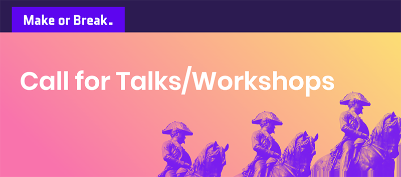

# [Make or Break 2018](https://makeorbreak.io) Call for Talks/Workshops

## How to submit a talk or workshop
Talk and workshop proposals are handled through GitHub pull requests. Follow the instructions below:

1. Fork this repository into your GitHub account.
1. Duplicate `talk_my-awesome-talk-title_my-name.md` or `workshop_my-awesome-workshop-title_my-name.md` template into a new file, depending if your presentation is a talk or a workshop.
1. Rename the new file using your presentation's title and your name (eg: `workshop_introduction-arduino-ecosystem-iot_mario-carneiro-joao-gradim.md` or `talk_react-natively_joao-anes.md`).
1. Edit the new file and fill in each section. Do not remove the template file.
1. Submit a pull request. For clarity, please paste your description file's contents into the pull request's description. Its contents will be seen as the pull request's first comment.

**Note:** One proposal per pull request, please. If you're proposing more than one presentation, please open separate pull requests.

### What happens next?

* Anyone will be able to comment and vote on your pull request.
* If your talk is accepted we will merge the pull request.
* We'll give feedback to anyone who submits a talk proposal even if isn't accepted.

The deadline for submitting talks is **to be determined**. After than we won't be accepting any more pull requests.

## What should be in the proposal?

Please see the given template files for details

#### Adding additional files

If you want to include any other files related to your presentation, like keynotes, code samples, videos, etc., make a directory with the same name as your presentation and put the files in there. If you prefer to link to content, there is a section for this in the proposal template.

#### Contact Info

Make sure that the email address you include in your proposal is reachable. We will use it to contact you.

## What makes a good proposal?

Our attendance is diverse, going from technical to non-technical people with a variable scope of knowledge. Your presentation doesn't have to please everyone at the same time. In the past we have had presentations in the past with themes as diverse as coffee making and television production, so your content doesn't even have to do anything with computers.

Be mindful that your description should be enough for anyone to tell if they would like to attend. If your talk is aimed at novices or experts of a particular topic be sure that your description gets this point across.

## I got accepted

If and when your talk gets accepted, you'll immediately receive an email from the organization with all the info and steps necessary before it gets included in the official calendar. Hurray!

## I got rejected

If your proposal gets rejected, don't be disappointed. And above all, don't give up, we have Make or Break every year. Your talk might not have made it for any number of reasons and most of the time they've nothing to do with quality or your ability to deliver.

Maybe a similar topic got covered in the previous year, or this year, and the curators decided not to run it this time. Maybe there were too many similar technical talks, and the curators opted for other themes. Or maybe your proposal just didn’t quite convince us this time.

 
Thanks,

The Make or Break team
